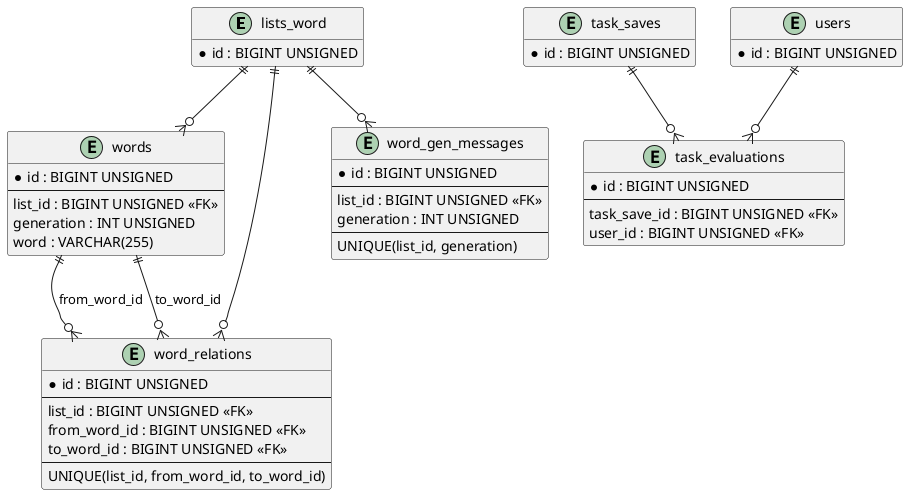

# Adatbázisok szerkezete

## 1. Bevezetés

Ez a dokumentum a projektben használt adatbázis-táblák végső szerkezetét mutatja be, MySQL `CREATE TABLE` jellegű formában, valamint összefoglalja a köztük lévő relációkat.

Megjegyzés: a dokumentum a migrációk és a jelenlegi alkalmazáslogika alapján készült. Ahol eredeti `create` migráció nem található a repóban (pl. `lists_word`, `words`, `color_lists`, `colors`), ott a szerkezet rekonstruált.

## 2. Relációk összefoglalása

- `users` 1 - N `lists_word`
- `users` 1 - N `color_lists`
- `users` 1 - N `board_save_groups`
- `users` 1 - N `task_save_groups`
- `users` 1 - N `task_saves`
- `users` 1 - N `task_evaluations`
- `users` 1 - N `access_logs` (nullable kapcsolat)
- `lists_word` 1 - N `words`
- `lists_word` 1 - N `word_gen_messages`
- `lists_word` 1 - N `word_relations`
- `lists_word` 1 - N `task_saves` (nullable kapcsolat `word_list_id` mezőn)
- `words` 1 - N `word_relations` (`from_word_id` és `to_word_id`)
- `color_lists` 1 - N `colors`
- `board_save_groups` 1 - N `board_saves`
- `task_save_groups` 1 - N `task_saves`
- `task_saves` 1 - N `task_evaluations`

## 3. Táblaszerkezetek (MySQL DDL)

## 3.1. users

```sql
CREATE TABLE `users` (
  `id` BIGINT UNSIGNED NOT NULL AUTO_INCREMENT,
  `username` VARCHAR(255) NOT NULL,
  `name` VARCHAR(255) NOT NULL,
  `email` VARCHAR(255) NOT NULL,
  `email_verified_at` TIMESTAMP NULL DEFAULT NULL,
  `role` VARCHAR(255) NOT NULL DEFAULT 'vendeg',
  `active` TINYINT(1) NOT NULL DEFAULT 1,
  `suspended_at` TIMESTAMP NULL DEFAULT NULL,
  `password` VARCHAR(255) NOT NULL,
  `remember_token` VARCHAR(100) NULL DEFAULT NULL,
  `created_at` TIMESTAMP NULL DEFAULT NULL,
  `updated_at` TIMESTAMP NULL DEFAULT NULL,
  PRIMARY KEY (`id`),
  UNIQUE KEY `users_username_unique` (`username`),
  UNIQUE KEY `users_email_unique` (`email`)
) ENGINE=InnoDB DEFAULT CHARSET=utf8mb4 COLLATE=utf8mb4_unicode_ci;
```

## 3.2. password_reset_tokens

```sql
CREATE TABLE `password_reset_tokens` (
  `email` VARCHAR(255) NOT NULL,
  `token` VARCHAR(255) NOT NULL,
  `created_at` TIMESTAMP NULL DEFAULT NULL,
  PRIMARY KEY (`email`)
) ENGINE=InnoDB DEFAULT CHARSET=utf8mb4 COLLATE=utf8mb4_unicode_ci;
```

## 3.3. sessions

```sql
CREATE TABLE `sessions` (
  `id` VARCHAR(255) NOT NULL,
  `user_id` BIGINT UNSIGNED NULL,
  `ip_address` VARCHAR(45) NULL,
  `user_agent` TEXT NULL,
  `payload` LONGTEXT NOT NULL,
  `last_activity` INT NOT NULL,
  PRIMARY KEY (`id`),
  KEY `sessions_user_id_index` (`user_id`),
  KEY `sessions_last_activity_index` (`last_activity`)
) ENGINE=InnoDB DEFAULT CHARSET=utf8mb4 COLLATE=utf8mb4_unicode_ci;
```

## 3.4. personal_access_tokens

```sql
CREATE TABLE `personal_access_tokens` (
  `id` BIGINT UNSIGNED NOT NULL AUTO_INCREMENT,
  `tokenable_type` VARCHAR(255) NOT NULL,
  `tokenable_id` BIGINT UNSIGNED NOT NULL,
  `name` TEXT NOT NULL,
  `token` VARCHAR(64) NOT NULL,
  `abilities` TEXT NULL,
  `last_used_at` TIMESTAMP NULL DEFAULT NULL,
  `expires_at` TIMESTAMP NULL DEFAULT NULL,
  `created_at` TIMESTAMP NULL DEFAULT NULL,
  `updated_at` TIMESTAMP NULL DEFAULT NULL,
  PRIMARY KEY (`id`),
  UNIQUE KEY `personal_access_tokens_token_unique` (`token`),
  KEY `personal_access_tokens_tokenable_type_tokenable_id_index` (`tokenable_type`, `tokenable_id`),
  KEY `personal_access_tokens_expires_at_index` (`expires_at`)
) ENGINE=InnoDB DEFAULT CHARSET=utf8mb4 COLLATE=utf8mb4_unicode_ci;
```

## 3.5. access_logs

```sql
CREATE TABLE `access_logs` (
  `id` BIGINT UNSIGNED NOT NULL AUTO_INCREMENT,
  `user_id` BIGINT UNSIGNED NULL,
  `event_type` VARCHAR(20) NOT NULL,
  `entry_point` VARCHAR(20) NOT NULL,
  `ip_address` VARCHAR(45) NOT NULL,
  `user_agent` VARCHAR(1024) NULL,
  `occurred_at` TIMESTAMP NOT NULL,
  `created_at` TIMESTAMP NULL DEFAULT NULL,
  `updated_at` TIMESTAMP NULL DEFAULT NULL,
  PRIMARY KEY (`id`),
  KEY `access_logs_event_type_entry_point_index` (`event_type`, `entry_point`),
  KEY `access_logs_occurred_at_index` (`occurred_at`),
  KEY `access_logs_user_id_index` (`user_id`),
  CONSTRAINT `access_logs_user_id_foreign`
    FOREIGN KEY (`user_id`) REFERENCES `users` (`id`) ON DELETE SET NULL
) ENGINE=InnoDB DEFAULT CHARSET=utf8mb4 COLLATE=utf8mb4_unicode_ci;
```

## 3.6. lists_word (rekonstruált)

```sql
CREATE TABLE `lists_word` (
  `id` BIGINT UNSIGNED NOT NULL AUTO_INCREMENT,
  `user_id` BIGINT UNSIGNED NOT NULL,
  `name` VARCHAR(255) NOT NULL,
  `public` TINYINT(1) NOT NULL DEFAULT 0,
  `notes` TEXT NULL,
  `wordlist` MEDIUMTEXT NULL,
  `created_at` TIMESTAMP NULL DEFAULT NULL,
  `updated_at` TIMESTAMP NULL DEFAULT NULL,
  PRIMARY KEY (`id`),
  KEY `lists_word_user_id_foreign` (`user_id`),
  CONSTRAINT `lists_word_user_id_foreign`
    FOREIGN KEY (`user_id`) REFERENCES `users` (`id`) ON DELETE CASCADE
) ENGINE=InnoDB DEFAULT CHARSET=utf8mb4 COLLATE=utf8mb4_unicode_ci;
```

## 3.7. words (rekonstruált)

```sql
CREATE TABLE `words` (
  `id` BIGINT UNSIGNED NOT NULL AUTO_INCREMENT,
  `list_id` BIGINT UNSIGNED NOT NULL,
  `generation` INT UNSIGNED NOT NULL DEFAULT 1,
  `word` VARCHAR(255) NOT NULL,
  `created_at` TIMESTAMP NULL DEFAULT NULL,
  `updated_at` TIMESTAMP NULL DEFAULT NULL,
  PRIMARY KEY (`id`),
  UNIQUE KEY `words_list_generation_word_unique` (`list_id`, `generation`, `word`),
  KEY `fk_words_list` (`list_id`),
  CONSTRAINT `fk_words_list`
    FOREIGN KEY (`list_id`) REFERENCES `lists_word` (`id`) ON DELETE CASCADE
) ENGINE=InnoDB DEFAULT CHARSET=utf8mb4 COLLATE=utf8mb4_unicode_ci;
```

## 3.8. word_gen_messages

```sql
CREATE TABLE `word_gen_messages` (
  `id` BIGINT UNSIGNED NOT NULL AUTO_INCREMENT,
  `list_id` BIGINT UNSIGNED NOT NULL,
  `generation` INT UNSIGNED NOT NULL,
  `correct_answer_message` TEXT NULL,
  `incorrect_answer_message` TEXT NULL,
  `created_at` TIMESTAMP NULL DEFAULT NULL,
  `updated_at` TIMESTAMP NULL DEFAULT NULL,
  PRIMARY KEY (`id`),
  UNIQUE KEY `word_gen_messages_list_generation_unique` (`list_id`, `generation`),
  KEY `word_gen_messages_list_id_foreign` (`list_id`),
  CONSTRAINT `word_gen_messages_list_id_foreign`
    FOREIGN KEY (`list_id`) REFERENCES `lists_word` (`id`) ON DELETE CASCADE
) ENGINE=InnoDB DEFAULT CHARSET=utf8mb4 COLLATE=utf8mb4_unicode_ci;
```

## 3.9. word_relations

```sql
CREATE TABLE `word_relations` (
  `id` BIGINT UNSIGNED NOT NULL AUTO_INCREMENT,
  `list_id` BIGINT UNSIGNED NOT NULL,
  `from_word_id` BIGINT UNSIGNED NOT NULL,
  `to_word_id` BIGINT UNSIGNED NOT NULL,
  `created_at` TIMESTAMP NULL DEFAULT NULL,
  `updated_at` TIMESTAMP NULL DEFAULT NULL,
  PRIMARY KEY (`id`),
  UNIQUE KEY `word_relations_unique` (`list_id`, `from_word_id`, `to_word_id`),
  KEY `word_relations_list_id_from_word_id_index` (`list_id`, `from_word_id`),
  KEY `word_relations_list_id_to_word_id_index` (`list_id`, `to_word_id`),
  CONSTRAINT `word_relations_list_id_foreign`
    FOREIGN KEY (`list_id`) REFERENCES `lists_word` (`id`) ON DELETE CASCADE,
  CONSTRAINT `word_relations_from_word_id_foreign`
    FOREIGN KEY (`from_word_id`) REFERENCES `words` (`id`) ON DELETE CASCADE,
  CONSTRAINT `word_relations_to_word_id_foreign`
    FOREIGN KEY (`to_word_id`) REFERENCES `words` (`id`) ON DELETE CASCADE
) ENGINE=InnoDB DEFAULT CHARSET=utf8mb4 COLLATE=utf8mb4_unicode_ci;
```

## 3.10. color_lists (rekonstruált)

```sql
CREATE TABLE `color_lists` (
  `id` BIGINT UNSIGNED NOT NULL AUTO_INCREMENT,
  `user_id` BIGINT UNSIGNED NOT NULL,
  `name` VARCHAR(255) NOT NULL,
  `created_at` TIMESTAMP NULL DEFAULT NULL,
  `updated_at` TIMESTAMP NULL DEFAULT NULL,
  PRIMARY KEY (`id`),
  KEY `color_lists_user_id_foreign` (`user_id`),
  CONSTRAINT `color_lists_user_id_foreign`
    FOREIGN KEY (`user_id`) REFERENCES `users` (`id`) ON DELETE CASCADE
) ENGINE=InnoDB DEFAULT CHARSET=utf8mb4 COLLATE=utf8mb4_unicode_ci;
```

## 3.11. colors (rekonstruált)

```sql
CREATE TABLE `colors` (
  `id` BIGINT UNSIGNED NOT NULL AUTO_INCREMENT,
  `list_id` BIGINT UNSIGNED NOT NULL,
  `color` VARCHAR(50) NOT NULL,
  `position` INT UNSIGNED NOT NULL,
  `created_at` TIMESTAMP NULL DEFAULT NULL,
  `updated_at` TIMESTAMP NULL DEFAULT NULL,
  PRIMARY KEY (`id`),
  UNIQUE KEY `colors_list_position_unique` (`list_id`, `position`),
  KEY `colors_list_id_foreign` (`list_id`),
  CONSTRAINT `colors_list_id_foreign`
    FOREIGN KEY (`list_id`) REFERENCES `color_lists` (`id`) ON DELETE CASCADE
) ENGINE=InnoDB DEFAULT CHARSET=utf8mb4 COLLATE=utf8mb4_unicode_ci;
```

## 3.12. board_save_groups

```sql
CREATE TABLE `board_save_groups` (
  `id` BIGINT UNSIGNED NOT NULL AUTO_INCREMENT,
  `user_id` BIGINT UNSIGNED NOT NULL,
  `name` VARCHAR(255) NOT NULL,
  `position` INT UNSIGNED NULL,
  `created_at` TIMESTAMP NULL DEFAULT NULL,
  `updated_at` TIMESTAMP NULL DEFAULT NULL,
  PRIMARY KEY (`id`),
  KEY `board_save_groups_user_id_foreign` (`user_id`),
  CONSTRAINT `board_save_groups_user_id_foreign`
    FOREIGN KEY (`user_id`) REFERENCES `users` (`id`) ON DELETE CASCADE
) ENGINE=InnoDB DEFAULT CHARSET=utf8mb4 COLLATE=utf8mb4_unicode_ci;
```

## 3.13. board_saves

```sql
CREATE TABLE `board_saves` (
  `id` BIGINT UNSIGNED NOT NULL AUTO_INCREMENT,
  `user_id` BIGINT UNSIGNED NOT NULL,
  `board_save_group_id` BIGINT UNSIGNED NOT NULL,
  `name` VARCHAR(255) NOT NULL,
  `payload` JSON NOT NULL,
  `created_at` TIMESTAMP NULL DEFAULT NULL,
  `updated_at` TIMESTAMP NULL DEFAULT NULL,
  PRIMARY KEY (`id`),
  UNIQUE KEY `board_saves_board_save_group_id_name_unique` (`board_save_group_id`, `name`),
  KEY `board_saves_user_id_foreign` (`user_id`),
  CONSTRAINT `board_saves_user_id_foreign`
    FOREIGN KEY (`user_id`) REFERENCES `users` (`id`) ON DELETE CASCADE,
  CONSTRAINT `board_saves_board_save_group_id_foreign`
    FOREIGN KEY (`board_save_group_id`) REFERENCES `board_save_groups` (`id`) ON DELETE CASCADE
) ENGINE=InnoDB DEFAULT CHARSET=utf8mb4 COLLATE=utf8mb4_unicode_ci;
```

## 3.14. task_save_groups

```sql
CREATE TABLE `task_save_groups` (
  `id` BIGINT UNSIGNED NOT NULL AUTO_INCREMENT,
  `user_id` BIGINT UNSIGNED NOT NULL,
  `name` VARCHAR(255) NOT NULL,
  `position` INT UNSIGNED NULL,
  `created_at` TIMESTAMP NULL DEFAULT NULL,
  `updated_at` TIMESTAMP NULL DEFAULT NULL,
  PRIMARY KEY (`id`),
  KEY `task_save_groups_user_id_foreign` (`user_id`),
  CONSTRAINT `task_save_groups_user_id_foreign`
    FOREIGN KEY (`user_id`) REFERENCES `users` (`id`) ON DELETE CASCADE
) ENGINE=InnoDB DEFAULT CHARSET=utf8mb4 COLLATE=utf8mb4_unicode_ci;
```

## 3.15. task_saves

```sql
CREATE TABLE `task_saves` (
  `id` BIGINT UNSIGNED NOT NULL AUTO_INCREMENT,
  `user_id` BIGINT UNSIGNED NOT NULL,
  `task_save_group_id` BIGINT UNSIGNED NOT NULL,
  `word_list_id` BIGINT UNSIGNED NULL,
  `name` VARCHAR(255) NOT NULL,
  `level` ENUM('Easy', 'Medium', 'Hard') NOT NULL DEFAULT 'Medium',
  `generation_mode` VARCHAR(50) NOT NULL,
  `board_size` INT UNSIGNED NOT NULL,
  `generations_count` INT UNSIGNED NOT NULL,
  `time_limit` INT UNSIGNED NOT NULL,
  `payload` JSON NOT NULL,
  `created_at` TIMESTAMP NULL DEFAULT NULL,
  `updated_at` TIMESTAMP NULL DEFAULT NULL,
  PRIMARY KEY (`id`),
  UNIQUE KEY `task_saves_group_name_unique` (`task_save_group_id`, `name`),
  KEY `task_saves_user_id_foreign` (`user_id`),
  KEY `task_saves_word_list_id_foreign` (`word_list_id`),
  CONSTRAINT `task_saves_user_id_foreign`
    FOREIGN KEY (`user_id`) REFERENCES `users` (`id`) ON DELETE CASCADE,
  CONSTRAINT `task_saves_task_save_group_id_foreign`
    FOREIGN KEY (`task_save_group_id`) REFERENCES `task_save_groups` (`id`) ON DELETE CASCADE,
  CONSTRAINT `task_saves_word_list_id_foreign`
    FOREIGN KEY (`word_list_id`) REFERENCES `lists_word` (`id`) ON DELETE SET NULL
) ENGINE=InnoDB DEFAULT CHARSET=utf8mb4 COLLATE=utf8mb4_unicode_ci;
```

## 3.16. task_evaluations

```sql
CREATE TABLE `task_evaluations` (
  `id` BIGINT UNSIGNED NOT NULL AUTO_INCREMENT,
  `task_save_id` BIGINT UNSIGNED NOT NULL,
  `user_id` BIGINT UNSIGNED NOT NULL,
  `date` DATETIME NOT NULL,
  `note` TEXT NULL,
  `filled_board` JSON NULL,
  `total_good_cell` INT UNSIGNED NOT NULL DEFAULT 0,
  `good_cell` INT UNSIGNED NOT NULL DEFAULT 0,
  `bad_cell` INT UNSIGNED NOT NULL DEFAULT 0,
  `unfilled_cell` INT UNSIGNED NOT NULL DEFAULT 0,
  `possible_sentence` INT UNSIGNED NOT NULL DEFAULT 0,
  `good_sentence` INT UNSIGNED NOT NULL DEFAULT 0,
  `bad_sentence` INT UNSIGNED NOT NULL DEFAULT 0,
  `duplicate_sentence` INT UNSIGNED NOT NULL DEFAULT 0,
  `sentence_result` TEXT NULL,
  `completed_time` INT UNSIGNED NOT NULL DEFAULT 0,
  `created_at` TIMESTAMP NULL DEFAULT NULL,
  `updated_at` TIMESTAMP NULL DEFAULT NULL,
  PRIMARY KEY (`id`),
  KEY `task_evaluations_task_save_id_user_id_index` (`task_save_id`, `user_id`),
  KEY `task_evaluations_date_index` (`date`),
  CONSTRAINT `task_evaluations_task_save_id_foreign`
    FOREIGN KEY (`task_save_id`) REFERENCES `task_saves` (`id`) ON DELETE CASCADE,
  CONSTRAINT `task_evaluations_user_id_foreign`
    FOREIGN KEY (`user_id`) REFERENCES `users` (`id`) ON DELETE CASCADE
) ENGINE=InnoDB DEFAULT CHARSET=utf8mb4 COLLATE=utf8mb4_unicode_ci;
```

## 3.17. cache

```sql
CREATE TABLE `cache` (
  `key` VARCHAR(255) NOT NULL,
  `value` MEDIUMTEXT NOT NULL,
  `expiration` INT NOT NULL,
  PRIMARY KEY (`key`),
  KEY `cache_expiration_index` (`expiration`)
) ENGINE=InnoDB DEFAULT CHARSET=utf8mb4 COLLATE=utf8mb4_unicode_ci;
```

## 3.18. cache_locks

```sql
CREATE TABLE `cache_locks` (
  `key` VARCHAR(255) NOT NULL,
  `owner` VARCHAR(255) NOT NULL,
  `expiration` INT NOT NULL,
  PRIMARY KEY (`key`),
  KEY `cache_locks_expiration_index` (`expiration`)
) ENGINE=InnoDB DEFAULT CHARSET=utf8mb4 COLLATE=utf8mb4_unicode_ci;
```

## 3.19. jobs

```sql
CREATE TABLE `jobs` (
  `id` BIGINT UNSIGNED NOT NULL AUTO_INCREMENT,
  `queue` VARCHAR(255) NOT NULL,
  `payload` LONGTEXT NOT NULL,
  `attempts` TINYINT UNSIGNED NOT NULL,
  `reserved_at` INT UNSIGNED NULL,
  `available_at` INT UNSIGNED NOT NULL,
  `created_at` INT UNSIGNED NOT NULL,
  PRIMARY KEY (`id`),
  KEY `jobs_queue_index` (`queue`)
) ENGINE=InnoDB DEFAULT CHARSET=utf8mb4 COLLATE=utf8mb4_unicode_ci;
```

## 3.20. job_batches

```sql
CREATE TABLE `job_batches` (
  `id` VARCHAR(255) NOT NULL,
  `name` VARCHAR(255) NOT NULL,
  `total_jobs` INT NOT NULL,
  `pending_jobs` INT NOT NULL,
  `failed_jobs` INT NOT NULL,
  `failed_job_ids` LONGTEXT NOT NULL,
  `options` MEDIUMTEXT NULL,
  `cancelled_at` INT NULL,
  `created_at` INT NOT NULL,
  `finished_at` INT NULL,
  PRIMARY KEY (`id`)
) ENGINE=InnoDB DEFAULT CHARSET=utf8mb4 COLLATE=utf8mb4_unicode_ci;
```

## 3.21. failed_jobs

```sql
CREATE TABLE `failed_jobs` (
  `id` BIGINT UNSIGNED NOT NULL AUTO_INCREMENT,
  `uuid` VARCHAR(255) NOT NULL,
  `connection` TEXT NOT NULL,
  `queue` TEXT NOT NULL,
  `payload` LONGTEXT NOT NULL,
  `exception` LONGTEXT NOT NULL,
  `failed_at` TIMESTAMP NOT NULL DEFAULT CURRENT_TIMESTAMP,
  PRIMARY KEY (`id`),
  UNIQUE KEY `failed_jobs_uuid_unique` (`uuid`)
) ENGINE=InnoDB DEFAULT CHARSET=utf8mb4 COLLATE=utf8mb4_unicode_ci;
```

## 4. PlantUML - összekapcsoló táblák

Az alábbi ábra a kapcsoló/összerendelő jellegű táblákat és kapcsolataikat mutatja (`word_relations`, `task_evaluations`, valamint a listához tartozó üzeneteket tároló `word_gen_messages`).



## 5. Kiegészítő megjegyzések

- A `task_saves.level` mező kezdetben `VARCHAR(20)` volt, majd migrációval `ENUM('Easy','Medium','Hard')` lett.
- A `task_evaluations` táblában a `duplicate_sentence` mező egy korábbi elnevezés (`unfield_sentence`) korrekciója után kapta a végleges nevét.
- A `lists` tábla neve migrációban `lists_word`-re változott, és a kapcsolódó idegen kulcsok ehhez igazodnak.
