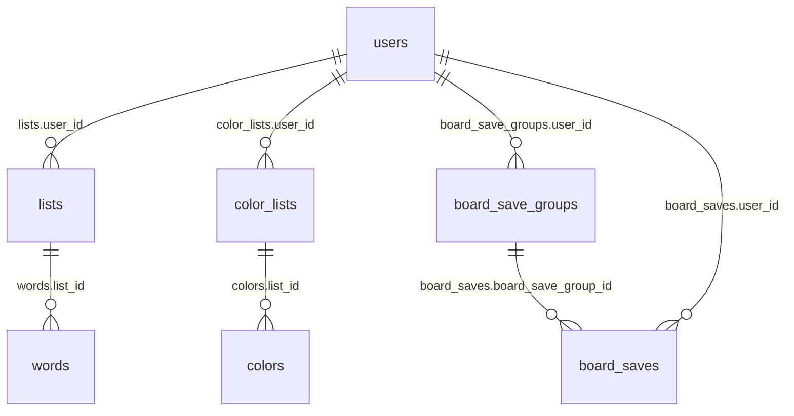

# Adatbázis séma (`cellauto`)

Ez a dokumentum a **MySQL** adatbázis aktuális táblaszerkezetét mutatja. A tartalom a szerveren futó adatbázisból lett leképezve (`SHOW CREATE TABLE` és `information_schema`), **nem** tartalmaz jelszót vagy egyéb titkot.

**Frissítés:** ha a séma változik, ezt a fájlt érdemes újragenerálni (vagy legalább a megfelelő `CREATE TABLE` részeket), illetve ellenőrizhető a Laravel oldalról is: `php artisan db:show`.

**Karakterkészlet / motor:** az alábbi táblák tipikusan `utf8mb4` + `utf8mb4_unicode_ci` kollációval és **InnoDB** motorral futnak.

## Áttekintő ER (logikai)



## Üzleti / API táblák

### `users`

Felhasználók, szerepkör és felfüggesztés mezőkkel.

| Oszlop | Típus | Megjegyzés |
|--------|--------|------------|
| `id` | `bigint unsigned`, PK, AI | |
| `username` | `varchar(255)`, NOT NULL | egyedi |
| `name` | `varchar(255)`, NOT NULL | |
| `email` | `varchar(255)`, NOT NULL | egyedi |
| `role` | `varchar(255)`, NOT NULL, default `vendeg` | |
| `active` | `tinyint(1)`, NOT NULL, default `1` | |
| `suspended_at` | `timestamp`, NULL | |
| `email_verified_at` | `timestamp`, NULL | |
| `password` | `varchar(255)`, NOT NULL | |
| `remember_token` | `varchar(100)`, NULL | |
| `created_at` | `timestamp`, NULL | |
| `updated_at` | `timestamp`, NULL | |

**Indexek:** `PRIMARY KEY (id)`, `UNIQUE (email)`, `UNIQUE (username)`.

<details>
<summary>SHOW CREATE TABLE (users)</summary>

```sql
CREATE TABLE `users` (
  `id` bigint unsigned NOT NULL AUTO_INCREMENT,
  `username` varchar(255) COLLATE utf8mb4_unicode_ci NOT NULL,
  `name` varchar(255) COLLATE utf8mb4_unicode_ci NOT NULL,
  `email` varchar(255) COLLATE utf8mb4_unicode_ci NOT NULL,
  `role` varchar(255) COLLATE utf8mb4_unicode_ci NOT NULL DEFAULT 'vendeg',
  `active` tinyint(1) NOT NULL DEFAULT '1',
  `suspended_at` timestamp NULL DEFAULT NULL,
  `email_verified_at` timestamp NULL DEFAULT NULL,
  `password` varchar(255) COLLATE utf8mb4_unicode_ci NOT NULL,
  `remember_token` varchar(100) COLLATE utf8mb4_unicode_ci DEFAULT NULL,
  `created_at` timestamp NULL DEFAULT NULL,
  `updated_at` timestamp NULL DEFAULT NULL,
  PRIMARY KEY (`id`),
  UNIQUE KEY `users_email_unique` (`email`),
  UNIQUE KEY `users_username_unique` (`username`)
) ENGINE=InnoDB DEFAULT CHARSET=utf8mb4 COLLATE=utf8mb4_unicode_ci;
```

</details>

---

### `lists`

Felhasználóhoz tartozó szólisták (`WordList` modell táblája).

| Oszlop | Típus | Megjegyzés |
|--------|--------|------------|
| `id` | `bigint unsigned`, PK, AI | |
| `user_id` | `bigint unsigned`, NOT NULL | FK → `users.id` |
| `name` | `varchar(255)`, NOT NULL | |
| `created_at` | `timestamp`, NULL | |
| `updated_at` | `timestamp`, NULL | |

**Indexek / kulcsok:** `PRIMARY KEY (id)`, index `fk_lists_user (user_id)`, **FK** `fk_lists_user`: `user_id` → `users(id)`.

<details>
<summary>SHOW CREATE TABLE (lists)</summary>

```sql
CREATE TABLE `lists` (
  `id` bigint unsigned NOT NULL AUTO_INCREMENT,
  `user_id` bigint unsigned NOT NULL,
  `name` varchar(255) COLLATE utf8mb4_unicode_ci NOT NULL,
  `created_at` timestamp NULL DEFAULT NULL,
  `updated_at` timestamp NULL DEFAULT NULL,
  PRIMARY KEY (`id`),
  KEY `fk_lists_user` (`user_id`),
  CONSTRAINT `fk_lists_user` FOREIGN KEY (`user_id`) REFERENCES `users` (`id`)
) ENGINE=InnoDB DEFAULT CHARSET=utf8mb4 COLLATE=utf8mb4_unicode_ci;
```

</details>

---

### `words`

Egy szólista elemei: szöveg + sorrend pozíció.

| Oszlop | Típus | Megjegyzés |
|--------|--------|------------|
| `id` | `bigint unsigned`, PK, AI | |
| `list_id` | `bigint unsigned`, NOT NULL | FK → `lists.id` |
| `word` | `varchar(255)`, NOT NULL | |
| `position` | `int unsigned`, NOT NULL | listán belüli sorrend |
| `created_at` | `timestamp`, NULL | |
| `updated_at` | `timestamp`, NULL | |

**Korlátok:**

- `UNIQUE (list_id, word)` – index neve a jelenlegi DB-ben: `list_id` (érdemes később beszédesebb névre átnevezni).
- `UNIQUE (list_id, position)` – `words_list_id_position_unique`.
- **FK** `fk_words_list`: `list_id` → `lists(id)`.

<details>
<summary>SHOW CREATE TABLE (words)</summary>

```sql
CREATE TABLE `words` (
  `id` bigint unsigned NOT NULL AUTO_INCREMENT,
  `list_id` bigint unsigned NOT NULL,
  `word` varchar(255) COLLATE utf8mb4_unicode_ci NOT NULL,
  `position` int unsigned NOT NULL,
  `created_at` timestamp NULL DEFAULT NULL,
  `updated_at` timestamp NULL DEFAULT NULL,
  PRIMARY KEY (`id`),
  UNIQUE KEY `list_id` (`list_id`,`word`),
  UNIQUE KEY `words_list_id_position_unique` (`list_id`,`position`),
  CONSTRAINT `fk_words_list` FOREIGN KEY (`list_id`) REFERENCES `lists` (`id`)
) ENGINE=InnoDB DEFAULT CHARSET=utf8mb4 COLLATE=utf8mb4_unicode_ci;
```

</details>

---

### `color_lists`

Színpaletta-listák felhasználónként.

| Oszlop | Típus | Megjegyzés |
|--------|--------|------------|
| `id` | `bigint unsigned`, PK, AI | |
| `user_id` | `bigint unsigned`, NOT NULL | FK → `users.id` |
| `name` | `varchar(255)`, NOT NULL | |
| `created_at` | `timestamp`, NULL | |
| `updated_at` | `timestamp`, NULL | |

**Indexek / kulcsok:** `PRIMARY KEY (id)`, index `fk_color_lists_user (user_id)`, **FK** `fk_color_lists_user`: `user_id` → `users(id)`.

<details>
<summary>SHOW CREATE TABLE (color_lists)</summary>

```sql
CREATE TABLE `color_lists` (
  `id` bigint unsigned NOT NULL AUTO_INCREMENT,
  `user_id` bigint unsigned NOT NULL,
  `name` varchar(255) COLLATE utf8mb4_unicode_ci NOT NULL,
  `created_at` timestamp NULL DEFAULT NULL,
  `updated_at` timestamp NULL DEFAULT NULL,
  PRIMARY KEY (`id`),
  KEY `fk_color_lists_user` (`user_id`),
  CONSTRAINT `fk_color_lists_user` FOREIGN KEY (`user_id`) REFERENCES `users` (`id`)
) ENGINE=InnoDB DEFAULT CHARSET=utf8mb4 COLLATE=utf8mb4_unicode_ci;
```

</details>

---

### `colors`

Egy színes lista elemei: szín string + pozíció.

| Oszlop | Típus | Megjegyzés |
|--------|--------|------------|
| `id` | `bigint unsigned`, PK, AI | |
| `list_id` | `bigint unsigned`, NOT NULL | FK → `color_lists.id` |
| `color` | `varchar(50)`, NOT NULL | pl. hex vagy név |
| `position` | `int`, NOT NULL | listán belüli egyedi sorrend |
| `created_at` | `timestamp`, NULL | |
| `updated_at` | `timestamp`, NULL | |

**Korlátok:**

- `UNIQUE (list_id, position)` – index neve: `list_id`.
- **FK** `fk_colors_list`: `list_id` → `color_lists(id)`.

<details>
<summary>SHOW CREATE TABLE (colors)</summary>

```sql
CREATE TABLE `colors` (
  `id` bigint unsigned NOT NULL AUTO_INCREMENT,
  `list_id` bigint unsigned NOT NULL,
  `color` varchar(50) COLLATE utf8mb4_unicode_ci NOT NULL,
  `position` int NOT NULL,
  `created_at` timestamp NULL DEFAULT NULL,
  `updated_at` timestamp NULL DEFAULT NULL,
  PRIMARY KEY (`id`),
  UNIQUE KEY `list_id` (`list_id`,`position`),
  CONSTRAINT `fk_colors_list` FOREIGN KEY (`list_id`) REFERENCES `color_lists` (`id`)
) ENGINE=InnoDB DEFAULT CHARSET=utf8mb4 COLLATE=utf8mb4_unicode_ci;
```

</details>

---

### `board_save_groups`

Táblaállapot-mentések **csoportjai** (felhasználónként). Migráció: `2026_04_10_120000_create_board_save_groups_table.php`.

| Oszlop | Típus | Megjegyzés |
|--------|--------|------------|
| `id` | `bigint unsigned`, PK, AI | |
| `user_id` | `bigint unsigned`, NOT NULL | FK → `users.id`, **ON DELETE CASCADE** |
| `name` | `varchar(255)`, NOT NULL | csoport neve |
| `position` | `int unsigned`, NULL | megjelenítési sorrend (opcionális) |
| `created_at` | `timestamp`, NULL | |
| `updated_at` | `timestamp`, NULL | |

**Indexek / kulcsok:** `PRIMARY KEY (id)`, index `board_save_groups_user_id_foreign (user_id)`, **FK** `board_save_groups_user_id_foreign`: `user_id` → `users(id)`.

<details>
<summary>SHOW CREATE TABLE (board_save_groups)</summary>

```sql
CREATE TABLE `board_save_groups` (
  `id` bigint unsigned NOT NULL AUTO_INCREMENT,
  `user_id` bigint unsigned NOT NULL,
  `name` varchar(255) COLLATE utf8mb4_unicode_ci NOT NULL,
  `position` int unsigned DEFAULT NULL,
  `created_at` timestamp NULL DEFAULT NULL,
  `updated_at` timestamp NULL DEFAULT NULL,
  PRIMARY KEY (`id`),
  KEY `board_save_groups_user_id_foreign` (`user_id`),
  CONSTRAINT `board_save_groups_user_id_foreign` FOREIGN KEY (`user_id`) REFERENCES `users` (`id`) ON DELETE CASCADE
) ENGINE=InnoDB DEFAULT CHARSET=utf8mb4 COLLATE=utf8mb4_unicode_ci;
```

</details>

---

### `board_saves`

Egy mentés egy csoporton belül: név + JSON **payload** (táblaállapot). Migráció: `2026_04_10_120001_create_board_saves_table.php`.

| Oszlop | Típus | Megjegyzés |
|--------|--------|------------|
| `id` | `bigint unsigned`, PK, AI | |
| `user_id` | `bigint unsigned`, NOT NULL | FK → `users.id` (szűréshez; **ON DELETE CASCADE**) |
| `board_save_group_id` | `bigint unsigned`, NOT NULL | FK → `board_save_groups.id`, **ON DELETE CASCADE** |
| `name` | `varchar(255)`, NOT NULL | mentés neve; **egyedi a csoporton belül** |
| `payload` | `json`, NOT NULL | lásd `docs/api-board-saves.md` |
| `created_at` | `timestamp`, NULL | |
| `updated_at` | `timestamp`, NULL | |

**Korlátok:**

- `UNIQUE (board_save_group_id, name)` – index neve: `board_saves_board_save_group_id_name_unique`.
- **FK** `board_saves_board_save_group_id_foreign`: `board_save_group_id` → `board_save_groups(id)`.
- **FK** `board_saves_user_id_foreign`: `user_id` → `users(id)`.

<details>
<summary>SHOW CREATE TABLE (board_saves)</summary>

```sql
CREATE TABLE `board_saves` (
  `id` bigint unsigned NOT NULL AUTO_INCREMENT,
  `user_id` bigint unsigned NOT NULL,
  `board_save_group_id` bigint unsigned NOT NULL,
  `name` varchar(255) COLLATE utf8mb4_unicode_ci NOT NULL,
  `payload` json NOT NULL,
  `created_at` timestamp NULL DEFAULT NULL,
  `updated_at` timestamp NULL DEFAULT NULL,
  PRIMARY KEY (`id`),
  UNIQUE KEY `board_saves_board_save_group_id_name_unique` (`board_save_group_id`,`name`),
  KEY `board_saves_user_id_foreign` (`user_id`),
  CONSTRAINT `board_saves_board_save_group_id_foreign` FOREIGN KEY (`board_save_group_id`) REFERENCES `board_save_groups` (`id`) ON DELETE CASCADE,
  CONSTRAINT `board_saves_user_id_foreign` FOREIGN KEY (`user_id`) REFERENCES `users` (`id`) ON DELETE CASCADE
) ENGINE=InnoDB DEFAULT CHARSET=utf8mb4 COLLATE=utf8mb4_unicode_ci;
```

</details>

---

## Laravel / infrastruktúra táblák

Ezek a framework funkciókhoz kellenek (session, cache, queue, migrációk, Sanctum tokenek, jelszó reset).

| Tábla | Szerep |
|-------|--------|
| `migrations` | futtatott migrációk nyilvántartása |
| `sessions` | munkamenet tárolás (`SESSION_DRIVER=database`) |
| `cache`, `cache_locks` | fájl/db cache backendhez |
| `jobs`, `job_batches`, `failed_jobs` | queue / batch / sikertelen jobok |
| `password_reset_tokens` | jelszó visszaállítás tokenek |
| `personal_access_tokens` | Laravel Sanctum API tokenek |

A `SHOW CREATE TABLE` kimenetek a projekt aktuális példányában így néznek ki:

<details>
<summary>personal_access_tokens</summary>

```sql
CREATE TABLE `personal_access_tokens` (
  `id` bigint unsigned NOT NULL AUTO_INCREMENT,
  `tokenable_type` varchar(255) COLLATE utf8mb4_unicode_ci NOT NULL,
  `tokenable_id` bigint unsigned NOT NULL,
  `name` text COLLATE utf8mb4_unicode_ci NOT NULL,
  `token` varchar(64) COLLATE utf8mb4_unicode_ci NOT NULL,
  `abilities` text COLLATE utf8mb4_unicode_ci,
  `last_used_at` timestamp NULL DEFAULT NULL,
  `expires_at` timestamp NULL DEFAULT NULL,
  `created_at` timestamp NULL DEFAULT NULL,
  `updated_at` timestamp NULL DEFAULT NULL,
  PRIMARY KEY (`id`),
  UNIQUE KEY `personal_access_tokens_token_unique` (`token`),
  KEY `personal_access_tokens_tokenable_type_tokenable_id_index` (`tokenable_type`,`tokenable_id`),
  KEY `personal_access_tokens_expires_at_index` (`expires_at`)
) ENGINE=InnoDB DEFAULT CHARSET=utf8mb4 COLLATE=utf8mb4_unicode_ci;
```

</details>

<details>
<summary>sessions, cache, cache_locks, jobs, failed_jobs, job_batches, password_reset_tokens, migrations</summary>

```sql
CREATE TABLE `sessions` (
  `id` varchar(255) COLLATE utf8mb4_unicode_ci NOT NULL,
  `user_id` bigint unsigned DEFAULT NULL,
  `ip_address` varchar(45) COLLATE utf8mb4_unicode_ci DEFAULT NULL,
  `user_agent` text COLLATE utf8mb4_unicode_ci,
  `payload` longtext COLLATE utf8mb4_unicode_ci NOT NULL,
  `last_activity` int NOT NULL,
  PRIMARY KEY (`id`),
  KEY `sessions_user_id_index` (`user_id`),
  KEY `sessions_last_activity_index` (`last_activity`)
) ENGINE=InnoDB DEFAULT CHARSET=utf8mb4 COLLATE=utf8mb4_unicode_ci;

CREATE TABLE `cache` (
  `key` varchar(255) COLLATE utf8mb4_unicode_ci NOT NULL,
  `value` mediumtext COLLATE utf8mb4_unicode_ci NOT NULL,
  `expiration` int NOT NULL,
  PRIMARY KEY (`key`),
  KEY `cache_expiration_index` (`expiration`)
) ENGINE=InnoDB DEFAULT CHARSET=utf8mb4 COLLATE=utf8mb4_unicode_ci;

CREATE TABLE `cache_locks` (
  `key` varchar(255) COLLATE utf8mb4_unicode_ci NOT NULL,
  `owner` varchar(255) COLLATE utf8mb4_unicode_ci NOT NULL,
  `expiration` int NOT NULL,
  PRIMARY KEY (`key`),
  KEY `cache_locks_expiration_index` (`expiration`)
) ENGINE=InnoDB DEFAULT CHARSET=utf8mb4 COLLATE=utf8mb4_unicode_ci;

CREATE TABLE `jobs` (
  `id` bigint unsigned NOT NULL AUTO_INCREMENT,
  `queue` varchar(255) COLLATE utf8mb4_unicode_ci NOT NULL,
  `payload` longtext COLLATE utf8mb4_unicode_ci NOT NULL,
  `attempts` tinyint unsigned NOT NULL,
  `reserved_at` int unsigned DEFAULT NULL,
  `available_at` int unsigned NOT NULL,
  `created_at` int unsigned NOT NULL,
  PRIMARY KEY (`id`),
  KEY `jobs_queue_index` (`queue`)
) ENGINE=InnoDB DEFAULT CHARSET=utf8mb4 COLLATE=utf8mb4_unicode_ci;

CREATE TABLE `failed_jobs` (
  `id` bigint unsigned NOT NULL AUTO_INCREMENT,
  `uuid` varchar(255) COLLATE utf8mb4_unicode_ci NOT NULL,
  `connection` text COLLATE utf8mb4_unicode_ci NOT NULL,
  `queue` text COLLATE utf8mb4_unicode_ci NOT NULL,
  `payload` longtext COLLATE utf8mb4_unicode_ci NOT NULL,
  `exception` longtext COLLATE utf8mb4_unicode_ci NOT NULL,
  `failed_at` timestamp NOT NULL DEFAULT CURRENT_TIMESTAMP,
  PRIMARY KEY (`id`),
  UNIQUE KEY `failed_jobs_uuid_unique` (`uuid`)
) ENGINE=InnoDB DEFAULT CHARSET=utf8mb4 COLLATE=utf8mb4_unicode_ci;

CREATE TABLE `job_batches` (
  `id` varchar(255) COLLATE utf8mb4_unicode_ci NOT NULL,
  `name` varchar(255) COLLATE utf8mb4_unicode_ci NOT NULL,
  `total_jobs` int NOT NULL,
  `pending_jobs` int NOT NULL,
  `failed_jobs` int NOT NULL,
  `failed_job_ids` longtext COLLATE utf8mb4_unicode_ci NOT NULL,
  `options` mediumtext COLLATE utf8mb4_unicode_ci,
  `cancelled_at` int DEFAULT NULL,
  `created_at` int NOT NULL,
  `finished_at` int DEFAULT NULL,
  PRIMARY KEY (`id`)
) ENGINE=InnoDB DEFAULT CHARSET=utf8mb4 COLLATE=utf8mb4_unicode_ci;

CREATE TABLE `password_reset_tokens` (
  `email` varchar(255) COLLATE utf8mb4_unicode_ci NOT NULL,
  `token` varchar(255) COLLATE utf8mb4_unicode_ci NOT NULL,
  `created_at` timestamp NULL DEFAULT NULL,
  PRIMARY KEY (`email`)
) ENGINE=InnoDB DEFAULT CHARSET=utf8mb4 COLLATE=utf8mb4_unicode_ci;

CREATE TABLE `migrations` (
  `id` int unsigned NOT NULL AUTO_INCREMENT,
  `migration` varchar(255) COLLATE utf8mb4_unicode_ci NOT NULL,
  `batch` int NOT NULL,
  PRIMARY KEY (`id`)
) ENGINE=InnoDB DEFAULT CHARSET=utf8mb4 COLLATE=utf8mb4_unicode_ci;
```

</details>

## Idegen kulcsok (összefoglaló)

| Tábla | FK név | Oszlop | Hivatkozás |
|--------|--------|--------|------------|
| `lists` | `fk_lists_user` | `user_id` | `users(id)` |
| `words` | `fk_words_list` | `list_id` | `lists(id)` |
| `color_lists` | `fk_color_lists_user` | `user_id` | `users(id)` |
| `colors` | `fk_colors_list` | `list_id` | `color_lists(id)` |
| `board_save_groups` | `board_save_groups_user_id_foreign` | `user_id` | `users(id)` |
| `board_saves` | `board_saves_board_save_group_id_foreign` | `board_save_group_id` | `board_save_groups(id)` |
| `board_saves` | `board_saves_user_id_foreign` | `user_id` | `users(id)` |

## Megjegyzés az indexnevekre

A `words` és `colors` táblákban egy-egy egyedi összetett index **neve** jelenleg `list_id`, ami összekeverhető az oszlopnévvel. Működik, de hosszabb távon érdemes lehet `words_list_word_unique` / `colors_list_position_unique` típusú nevekre átnevezni (külön migrációval).
