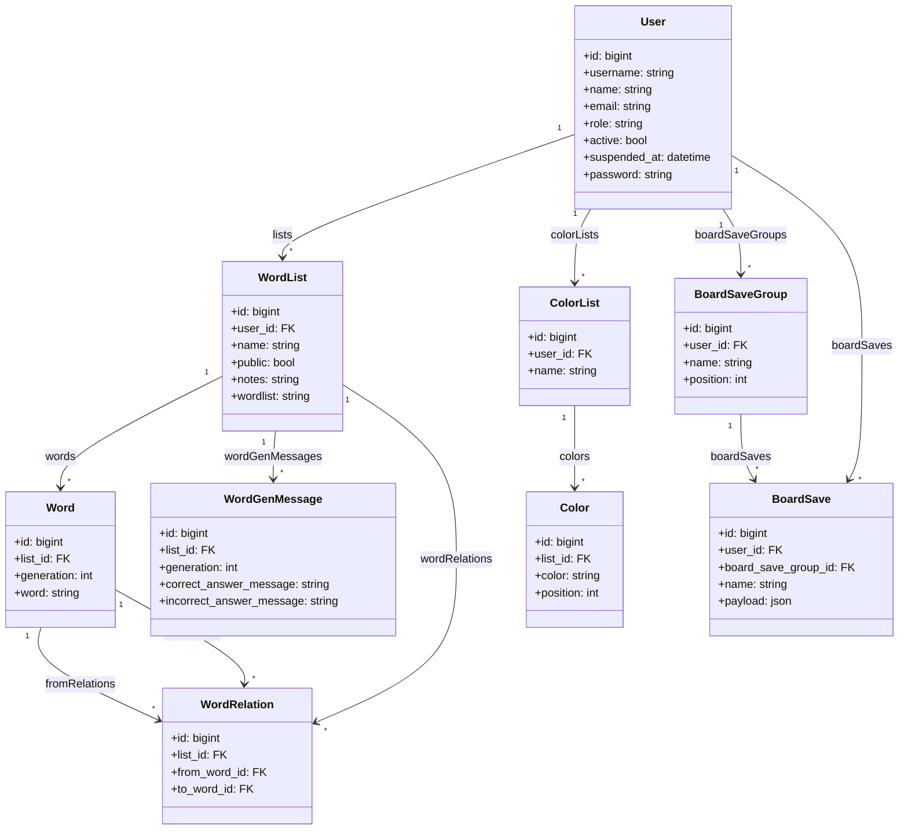
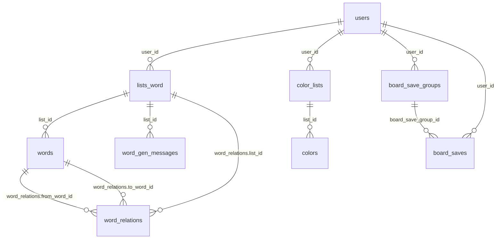
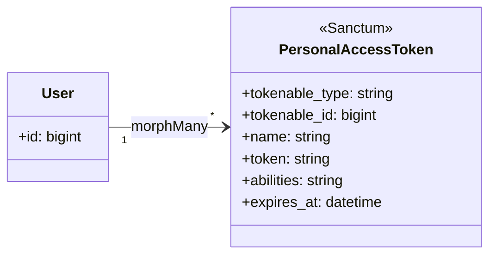
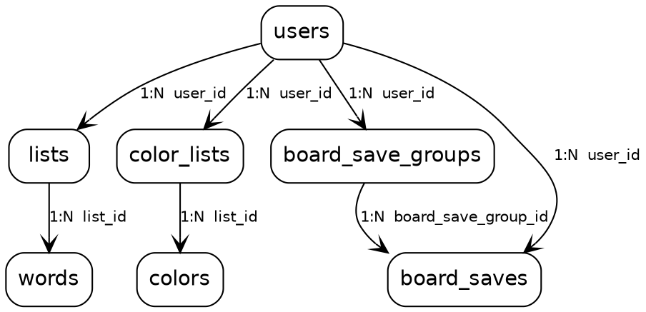
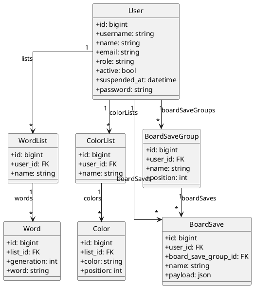
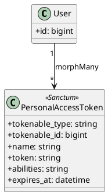

# Adatbázis UML – entitások és kapcsolatok

Ez a dokumentum a **cellauto** adatbázis **logikai modelljét** UML-szerű **osztálydiagram** formában foglalja össze (Mermaid). A részletes oszlopleírások és SQL a [`database-schema.md`](database-schema.md)-ben találhatók.

**Verzió:** 1.2 · **Dátum:** 2026-04-16

---

## 1. Üzleti / domain modell

A felhasználó (`User`) központi entitás: szólisták, színpaletták és táblaállapot-mentések csoportjai mind hozzá kötődnek. A `board_saves` tábla mind a felhasználóra, mind a csoportra mutat (szűrés és integritás miatt); törléskor a migrációk **CASCADE** szabályt használnak a kapcsolódó sorokra.

**Megjegyzések:**

- `Word`: generáció-alapú; egyedi a `(list_id, generation, word)` (lásd séma).
- `WordGenMessage`: generációnként opcionális helyes/helytelen válasz szöveg a listához (`UNIQUE(list_id, generation)`).
- `WordRelation`: csak szomszédos generációk között értelmezett (GENn -> GENn+1), listán belül.
- `Color`: egy színes listán belül egyedi a `(list_id, position)`.
- `BoardSave`: egy csoporton belül egyedi a `name` (`board_save_group_id` + `name`).

---

## 2. ER nézet (összefoglaló)

Az alábbi **entity–relationship** diagram ugyanezt a modellt mutatja klasszikus ER jelöléssel (összhangban a [`database-schema.md`](database-schema.md) „Áttekintő ER” blokkjával).

---

## 3. Auth (Sanctum) – asszociáció

A `personal_access_tokens` tábla **polimorf** kapcsolattal hivatkozik a token tulajdonosára (`tokenable_type`, `tokenable_id`). Tipikus esetben a típus a `User` modell, azaz egy felhasználónak több API tokenje lehet.

---

## 4. Laravel infrastruktúra (nem üzleti modell)

Ezek a táblák framework funkciókhoz kellenek (session, cache, queue, migrációk, jelszó reset). Önálló üzleti entitásokként általában nem modellezzük őket; a [`database-schema.md`](database-schema.md) táblázatában vannak felsorolva.

| Tábla | Szerep |
|-------|--------|
| `migrations` | futtatott migrációk |
| `sessions` | DB session (`SESSION_DRIVER=database`) |
| `cache`, `cache_locks` | cache backend |
| `jobs`, `job_batches`, `failed_jobs` | queue |
| `password_reset_tokens` | jelszó visszaállítás |

---

## 5. Gráf / grafikon formátumok (exportálható kép)

Az alábbi formátumokból **valódi grafikon** (PNG, SVG, PDF) készíthető külső eszközökkel – ez nem a Mermaid beépített nézete, hanem iparági szabványos gráf-leírás.

### 5.1 Graphviz (DOT)

A fájlt mentheted pl. `database-domain.dot` néven, majd:

`dot -Tpng database-domain.dot -o database-domain.png` vagy `-Tsvg` SVG-hez.

### 5.2 PlantUML (osztálydiagram → PNG/SVG)

PlantUML [online](https://www.plantuml.com/plantuml/) vagy CLI (`plantuml` jar / extension) segítségével renderelhető.

### 5.3 PlantUML – Sanctum token (külön gráf)

