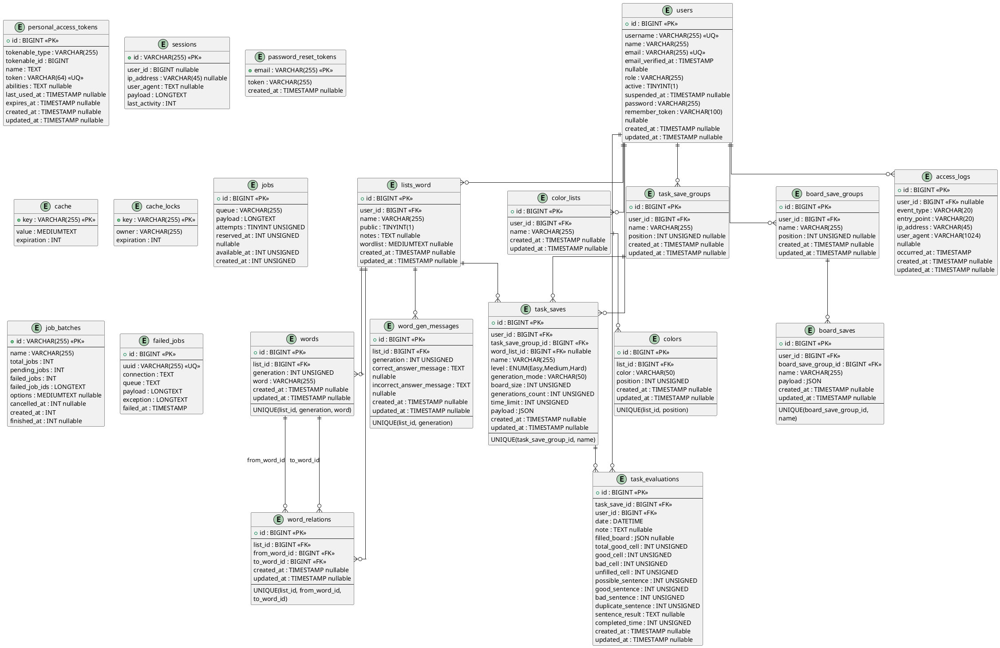
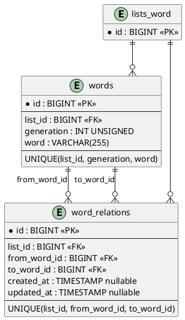
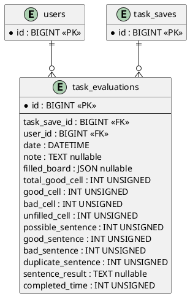
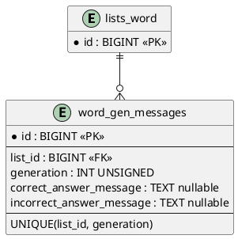
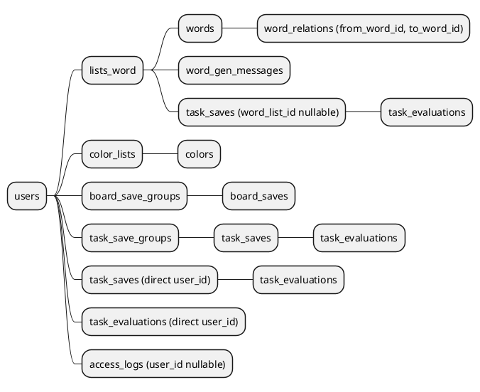
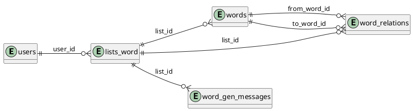
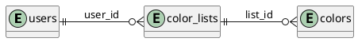
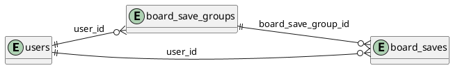
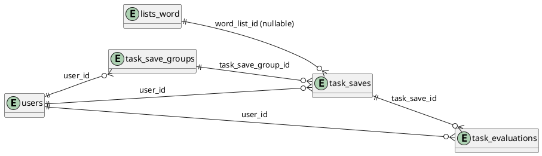
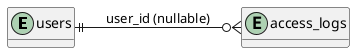

# Database Relations UML

## 1. Cél

Ez a dokumentum kizárólag az adatbázis relációinak PlantUML leírását tartalmazza, részletes bontásban:

- teljes adatbázis-ER nézet (fő üzleti és rendszer táblákkal),
- külön fókusz az összekapcsoló táblákra,
- táblánkénti oszlop- és kulcsrészletek.

## 2. Jelölések

- `<<PK>>`: elsődleges kulcs
- `<<FK>>`: idegen kulcs
- `<<UQ>>`: egyedi kulcs
- `nullable`: a mező lehet `NULL`
- Kapcsolatok:
  - `||--o{` = egy-a-többhöz
  - `}|--||` = sok-az-egyhez (irányított értelmezés)

## 3. Teljes relációs modell (PlantUML)

## 4. Összekapcsoló táblák - külön bontásban (PlantUML)

### 4.1. word_relations (önkapcsoló + listakapcsoló)

Részletek:
- `word_relations` egyszerre kapcsolódik a listához és két külön szó rekordhoz.
- A `UNIQUE(list_id, from_word_id, to_word_id)` megakadályozza a duplikált él létrehozását.
- Alkalmazási szabály szerint a kapcsolat tipikusan `GENn -> GENn+1` között értelmezett.

### 4.2. task_evaluations (felhasználó + feladat összerendelés)

Részletek:
- Egy felhasználó több értékelést is adhat több külön feladatra.
- Egy feladathoz több értékelés tartozhat (több felhasználó vagy több próbálkozás).
- A kapcsolat nem klasszikus N-N pivot, de funkcionálisan összerendelő tábla (`users` + `task_saves`).

### 4.3. word_gen_messages (lista + generáció összerendelés)

Részletek:
- Generációnként legfeljebb egy üzenetpár tárolható listán belül.
- A `UNIQUE(list_id, generation)` biztosítja az egyértelműséget.

## 5. Kulcs- és integritási megjegyzések

- `ON DELETE CASCADE` dominánsan a tulajdonosi relációknál jelenik meg (pl. lista -> szavak, csoport -> mentések).
- `ON DELETE SET NULL` ott van, ahol historikus rekord megtartható referencia nélkül is (pl. `access_logs.user_id`, `task_saves.word_list_id`).
- A JSON típusú mezők (`payload`, `filled_board`) strukturált kliensadatok tárolására szolgálnak.
- Több üzleti szabály nem csak adatbázisban, hanem alkalmazáslogikában érvényesül (például szórelációk generációs szomszédsága).

## 6. User-központú fa szerkezet (külön)

Az alábbi rész kifejezetten a `users` táblából indul ki, és fa jelleggel mutatja a kapcsolódó táblákat.

### 6.1. Teljes user-fa (PlantUML mindmap)

### 6.2. User ágak külön-külön (PlantUML)

#### 6.2.1. User -> Szólista ág

#### 6.2.2. User -> Színek ág

#### 6.2.3. User -> Tábla mentések ág

#### 6.2.4. User -> Feladat mentések és értékelések ág

#### 6.2.5. User -> Hozzáférési napló ág

### 6.3. Több apró részlet (user nézőpont)

- A `task_saves` kétszeresen kötődik a userhez: közvetlenül (`task_saves.user_id`) és közvetetten (`task_save_groups` ágon).
- A `task_evaluations` is kétszeresen kapcsolódik: a kitöltő userhez (`user_id`) és az értékelt feladathoz (`task_save_id`).
- A `word_relations` valójában irányított gráfél: egy listán belül `from_word_id -> to_word_id`.
- Az `access_logs.user_id` nullable, így naplóbejegyzés felhasználó törlése után is megmaradhat.
- A `task_saves.word_list_id` nullable kapcsolat, ezért a feladatmentés akkor is létezhet, ha a hivatkozott szólista megszűnik.
