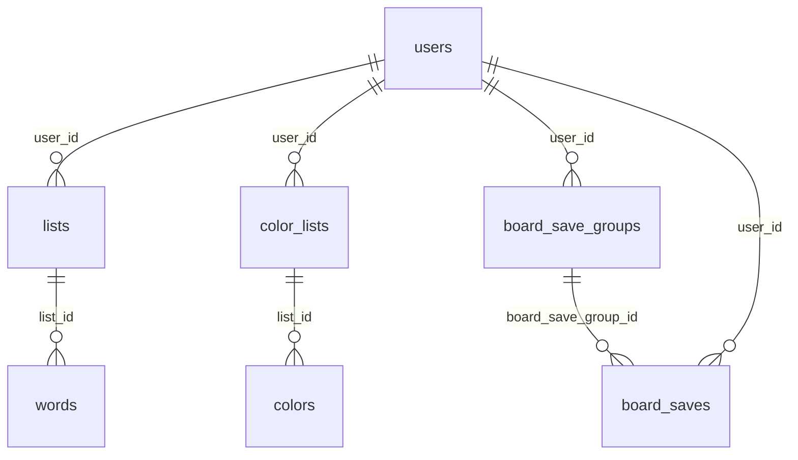

# Követelményspecifikáció – Adatbázis (táblák, szerepek, integritás)

| Mező | Érték |
|------|--------|
| **Verzió** | 1.0 |
| **Dátum** | 2026-04-11 |
| **Hatókör** | A `cellauto` (vagy egyenértékű) adatbázis **logikai felépítése**, tábláinak **üzleti szerepe**, **kulcs- és FK-szabályai**, valamint a **Laravel infrastruktúra** tábláinak célja |
| **Forrás** | `docs/database-schema.md`, `database/migrations/*.php` |
| **Kapcsolódó dokumentumok** | `kovetelmenyspecifikacio-tablamentesek.md`, `api-board-saves.md`, `api-lists-words.md`, `api-color-lists-colors.md`, `api-users.md` |

---

## 1. Bevezetés

### 1.1 Cél

Az adatbázis a sejtautomata API **perzisztens rétege**: felhasználók, azokhoz kötött szólisták és színpaletták, táblaállapot-mentések, valamint a framework (session, cache, auth tokenek stb.) adatainak tárolása. Ez a dokumentum **követelményszinten** rögzíti, **mely tábla milyen szerepet tölt be**, és **milyen integritási szabályok** kötik össze őket.

### 1.2 Hatókör (scope)

**Benne van:**

- Üzleti / domain táblák: `users`, `lists`, `words`, `color_lists`, `colors`, `board_save_groups`, `board_saves`.
- Infrastruktúra táblák: `migrations`, `sessions`, `cache`, `cache_locks`, `jobs`, `job_batches`, `failed_jobs`, `password_reset_tokens`, `personal_access_tokens`.

**Kívül esik:**

- Konkrét SQL `CREATE TABLE` teljes szövege (részletek: `database-schema.md`).
- Adatbázis-felhasználó jogosultságok (MySQL `GRANT`) – üzemeltetési réteg.

### 1.3 Fogalmak

| Fogalom | Meghatározás |
|---------|----------------|
| **Üzleti tábla** | Az alkalmazás domain modelljét közvetlenül tároló tábla (lista, szó, mentés stb.). |
| **Infrastruktúra tábla** | Laravel / session / queue működéséhez szükséges, nem üzleti entitás. |
| **FK (idegen kulcs)** | Oszlop, amely más tábla elsődleges kulcsára hivatkozik; törlési viselkedés: a séma szerint `CASCADE` vagy alap RESTRICT (lásd táblánként). |
| **Denormalizált user_id** | Pl. `board_saves.user_id`: gyors szűrés és konzisztencia a tulajdonossal; a csoport FK-ja mellett is tárolva. |

---

## 2. Globális követelmények az adatbázisra

| Azonosító | Követelmény |
|-----------|-------------|
| **DB-GLOBAL-01** | Motor: **InnoDB** (tranzakciók, FK támogatás). |
| **DB-GLOBAL-02** | Karakterkészlet: **utf8mb4**, kolláció tipikusan **utf8mb4_unicode_ci** (teljes Unicode, pl. emoji-kompatibilitás). |
| **DB-GLOBAL-03** | Az üzleti táblák időbélyegei (`created_at`, `updated_at`) a Laravel konvenció szerint nullable timestamp mezők, ahol a migráció ezt tartalmazza. |
| **DB-GLOBAL-04** | A részletes oszloplista és `SHOW CREATE TABLE` a séma változásakor frissítendő forrás: **`docs/database-schema.md`**. |

---

## 3. Üzleti táblák és szerepük

### 3.1 `users` – felhasználók

| Mező | Érték |
|------|--------|
| **Szerep** | Központi identitás: bejelentkezés, szerepkör (`role`), aktív/felfüggesztett állapot (`suspended_at`), egyedi `username` és `email`. |
| **Kapcsolatok** | 1:N minden userhez kötött erőforráshoz (`lists`, `color_lists`, `board_save_groups`, közvetve `words`/`colors`, közvetlenül `board_saves`). |
| **Kulcs követelmények** | PK `id`; **UNIQUE** `email`, **UNIQUE** `username`. |

| Azonosító | Követelmény |
|-----------|-------------|
| **DB-USER-01** | Minden más üzleti tábla, amely `user_id`-t tartalmaz, a felhasználó törlésekor vagy **CASCADE**-szel tisztul, vagy FK nélkül kezelt (lásd séma) – a jelen séma szerint a listák, színes listák, board csoportok/mentések **user FK**-val kötöttek. |

---

### 3.2 `lists` – szólisták

| Mező | Érték |
|------|--------|
| **Szerep** | Egy felhasználó **nev szerinti szólistái** (pl. tantárgyanként, feladatanként). |
| **Kapcsolatok** | `user_id` → `users.id`; 1:N a `words` táblára. |
| **Kulcs követelmények** | PK `id`; FK `user_id` → `users(id)`. |

| Azonosító | Követelmény |
|-----------|-------------|
| **DB-LIST-01** | Egy lista rekord pontosan egy felhasználóhoz tartozik. |

---

### 3.3 `words` – szavak generációkban egy listán belül

| Mező | Érték |
|------|--------|
| **Szerep** | A szólista elemei **generációkba** (`GEN1..GENN`) szervezve: szöveg. |
| **Kapcsolatok** | `list_id` → `lists.id`. |
| **Kulcs követelmények** | **UNIQUE** `(list_id, generation, word)`; FK `list_id`. |

| Azonosító | Követelmény |
|-----------|-------------|
| **DB-WORD-01** | Ugyanaz a szöveg nem duplikálható ugyanabban a listában **és generációban**. |
| **DB-WORD-02** | A generációk 1-től N-ig folytonosan kezelendők; minden generációban legalább egy szó kötelező. |

---

### 3.4 `color_lists` – színpaletta-listák

| Mező | Érték |
|------|--------|
| **Szerep** | Felhasználónként **nev szerinti színpaletta-konténerek** (pl. „Alap”, „ZH”). |
| **Kapcsolatok** | `user_id` → `users.id`; 1:N a `colors` táblára. |

| Azonosító | Követelmény |
|-----------|-------------|
| **DB-COLORLIST-01** | Paletta lista rekord pontosan egy felhasználóhoz kötődik. |

---

### 3.5 `colors` – színek egy palettán belül

| Mező | Érték |
|------|--------|
| **Szerep** | Egy paletta **színei** (string reprezentáció) és **egyedi pozíció** listán belül. |
| **Kapcsolatok** | `list_id` → `color_lists.id`. |
| **Kulcs követelmények** | **UNIQUE** `(list_id, position)`; FK `list_id`. |

| Azonosító | Követelmény |
|-----------|-------------|
| **DB-COLOR-01** | Ugyanazon `list_id` alatt egy pozíció csak egy színhez tartozhat. |

---

### 3.6 `board_save_groups` – táblaállapot-mentés csoportok

| Mező | Érték |
|------|--------|
| **Szerep** | Felhasználónként **logikai mappák** a táblaállapot-mentések számára; opcionális **megjelenítési sorrend** (`position`). |
| **Kapcsolatok** | `user_id` → `users.id` **ON DELETE CASCADE**; 1:N a `board_saves` táblára. |
| **Migráció** | `2026_04_10_120000_create_board_save_groups_table.php` |

| Azonosító | Követelmény |
|-----------|-------------|
| **DB-BSG-01** | Felhasználó törlésekor a csoportjai automatikusan törlődnek (CASCADE). |

---

### 3.7 `board_saves` – konkrét táblaállapot-mentések

| Mező | Érték |
|------|--------|
| **Szerep** | Egy csoporton belüli **elnevezett pillanatkép**: a táblaállapot **JSON `payload`**-ban; név **egyedi a csoporton belül**. |
| **Kapcsolatok** | `board_save_group_id` → `board_save_groups.id` **ON DELETE CASCADE**; `user_id` → `users.id` **ON DELETE CASCADE** (gyors lekérdezés és konzisztencia). |
| **Kulcs követelmények** | **UNIQUE** `(board_save_group_id, name)`. |
| **Payload** | `json`, NOT NULL – tartalmi séma információsan: `docs/api-board-saves.md`. |
| **Migráció** | `2026_04_10_120001_create_board_saves_table.php` |

| Azonosító | Követelmény |
|-----------|-------------|
| **DB-BS-01** | Csoport törlésekor a hozzá tartozó mentések törlődnek (CASCADE a csoport FK-n). |
| **DB-BS-02** | Felhasználó törlésekor a mentések törlődnek (CASCADE a user FK-n). |
| **DB-BS-03** | Ugyanazon csoporton belül két mentés nem viselheti ugyanazt a nevet (UNIQUE kényszer). |

---

## 4. Logikai ER (követelmény: konzisztens modell)

A következő entitás-kapcsolatok **követelményként** érvényesek (egyezik a `database-schema.md` mermaid diagramjával):

---

## 5. Infrastruktúra táblák és szerepük

Ezek **nem** az üzleti domain részei, hanem a Laravel futásához / API auth-hoz szükségesek.

| Tábla | Szerep (követelmény) |
|-------|----------------------|
| `migrations` | Mely migráció futott le, melyik batch-ben – séma verzió követés. |
| `sessions` | Ha `SESSION_DRIVER=database`, szerver oldali session tárolás. |
| `cache`, `cache_locks` | Adatbázis-alapú cache és zárolás. |
| `jobs`, `job_batches`, `failed_jobs` | Queue: háttérfeladatok, batch összesítés, sikertelen jobok naplója. |
| `password_reset_tokens` | Jelszó-visszaállítási tokenek (email kulcson). |
| `personal_access_tokens` | **Laravel Sanctum** személyes API tokenek (`Bearer` hitelesítés). |

| Azonosító | Követelmény |
|-----------|-------------|
| **DB-INFRA-01** | Az API védett végpontjai a `personal_access_tokens` (és a User modell) révén azonosítják a hívót; a token tábla nélkül a tokenes auth nem működik. |

---

## 6. Idegen kulcsok összefoglalója (követelmény: referenciális integritás)

| Forrás tábla | Oszlop | Cél | Megjegyzés |
|--------------|--------|-----|------------|
| `lists` | `user_id` | `users.id` | |
| `words` | `list_id` | `lists.id` | |
| `color_lists` | `user_id` | `users.id` | |
| `colors` | `list_id` | `color_lists.id` | |
| `board_save_groups` | `user_id` | `users.id` | ON DELETE CASCADE |
| `board_saves` | `board_save_group_id` | `board_save_groups.id` | ON DELETE CASCADE |
| `board_saves` | `user_id` | `users.id` | ON DELETE CASCADE |

---

## 7. Nem funkcionális követelmények (adatréteg)

| Azonosító | Követelmény |
|-----------|-------------|
| **NFR-DB-01** | A `board_saves.payload` nagy méretű lehet; indexelés és lista-lekérdezés teljesítménye üzem közben figyelendő (alkalmazásréteg: szűkített oszloplista lehetséges jövőbeli optimalizáció). |
| **NFR-DB-02** | JSON típus: MySQL 5.7.8+ / MariaDB 10.2.7+ natív JSON; fejlesztői SQLite kompatibilitás a Laravel rétegben. |

---

## 8. Ismert séma-jellegű megjegyzések

| Téma | Követelmény / javaslat |
|------|-------------------------|
| Indexnevek | A `words` és `colors` táblákban egyedi összetett indexek neve jelenleg **`list_id`**, ami összekeverhető az oszlopnévvel; hosszabb távon átnevezés javasolt (`database-schema.md`). |

---

## 9. Traceability

| Követelménycsoport | Részletes forrás |
|---------------------|------------------|
| Oszlopok, CREATE TABLE | `docs/database-schema.md` |
| Migrációk időrendje | `database/migrations/` |
| Board mentés üzleti követelmény | `docs/kovetelmenyspecifikacio-tablamentesek.md` |

---

## 10. Verziótörténet

| Verzió | Dátum | Változás |
|--------|--------|----------|
| 1.0 | 2026-04-11 | Első követelményspecifikáció az adatbázis tábláiról és szerepeikről |
