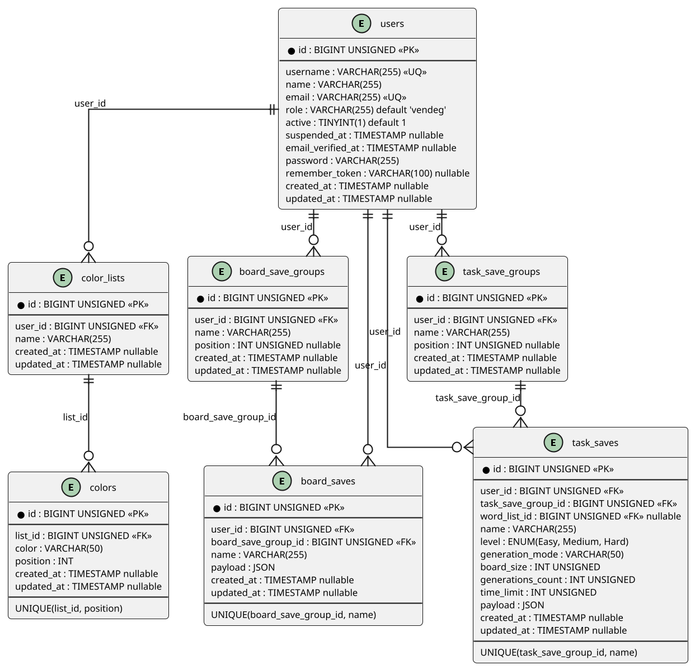

# UML (words nélkül) – teljes mezőlista

```plantuml
@startuml
top to bottom direction
hide methods
hide stereotypes
skinparam linetype ortho
skinparam dpi 200
skinparam defaultFontName Arial
skinparam defaultFontSize 8
skinparam ranksep 40
skinparam nodesep 16
skinparam shadowing false
skinparam roundcorner 6

entity "users" as users {
  *id : BIGINT UNSIGNED <<PK>>
  --
  username : VARCHAR(255) <<UQ>>
  name : VARCHAR(255)
  email : VARCHAR(255) <<UQ>>
  role : VARCHAR(255) default 'vendeg'
  active : TINYINT(1) default 1
  suspended_at : TIMESTAMP nullable
  email_verified_at : TIMESTAMP nullable
  password : VARCHAR(255)
  remember_token : VARCHAR(100) nullable
  created_at : TIMESTAMP nullable
  updated_at : TIMESTAMP nullable
}

entity "color_lists" as color_lists {
  *id : BIGINT UNSIGNED <<PK>>
  --
  user_id : BIGINT UNSIGNED <<FK>>
  name : VARCHAR(255)
  created_at : TIMESTAMP nullable
  updated_at : TIMESTAMP nullable
}

entity "colors" as colors {
  *id : BIGINT UNSIGNED <<PK>>
  --
  list_id : BIGINT UNSIGNED <<FK>>
  color : VARCHAR(50)
  position : INT
  created_at : TIMESTAMP nullable
  updated_at : TIMESTAMP nullable
  --
  UNIQUE(list_id, position)
}

entity "board_save_groups" as board_save_groups {
  *id : BIGINT UNSIGNED <<PK>>
  --
  user_id : BIGINT UNSIGNED <<FK>>
  name : VARCHAR(255)
  position : INT UNSIGNED nullable
  created_at : TIMESTAMP nullable
  updated_at : TIMESTAMP nullable
}

entity "board_saves" as board_saves {
  *id : BIGINT UNSIGNED <<PK>>
  --
  user_id : BIGINT UNSIGNED <<FK>>
  board_save_group_id : BIGINT UNSIGNED <<FK>>
  name : VARCHAR(255)
  payload : JSON
  created_at : TIMESTAMP nullable
  updated_at : TIMESTAMP nullable
  --
  UNIQUE(board_save_group_id, name)
}

entity "task_save_groups" as task_save_groups {
  *id : BIGINT UNSIGNED <<PK>>
  --
  user_id : BIGINT UNSIGNED <<FK>>
  name : VARCHAR(255)
  position : INT UNSIGNED nullable
  created_at : TIMESTAMP nullable
  updated_at : TIMESTAMP nullable
}

entity "task_saves" as task_saves {
  *id : BIGINT UNSIGNED <<PK>>
  --
  user_id : BIGINT UNSIGNED <<FK>>
  task_save_group_id : BIGINT UNSIGNED <<FK>>
  word_list_id : BIGINT UNSIGNED <<FK>> nullable
  name : VARCHAR(255)
  level : ENUM(Easy, Medium, Hard)
  generation_mode : VARCHAR(50)
  board_size : INT UNSIGNED
  generations_count : INT UNSIGNED
  time_limit : INT UNSIGNED
  payload : JSON
  created_at : TIMESTAMP nullable
  updated_at : TIMESTAMP nullable
  --
  UNIQUE(task_save_group_id, name)
}

users ||--o{ color_lists : user_id
color_lists ||--o{ colors : list_id

users ||--o{ board_save_groups : user_id
board_save_groups ||--o{ board_saves : board_save_group_id
users ||--o{ board_saves : user_id

users ||--o{ task_save_groups : user_id
task_save_groups ||--o{ task_saves : task_save_group_id
users ||--o{ task_saves : user_id

@enduml
```
