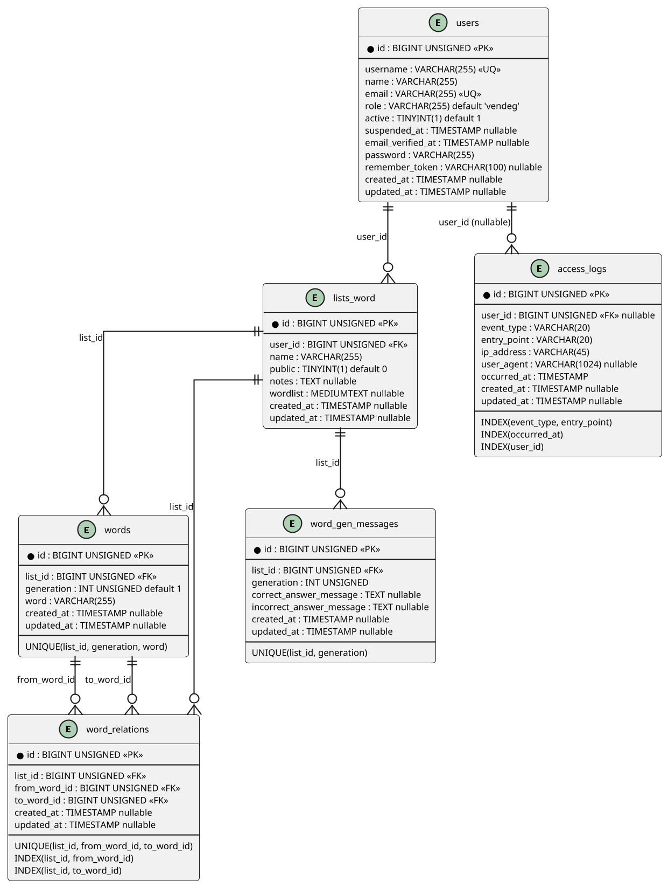

# UML (words modul) – teljes mezőlista

```plantuml
@startuml
top to bottom direction
hide methods
hide stereotypes
skinparam linetype ortho
skinparam dpi 200
skinparam defaultFontName Arial
skinparam defaultFontSize 8
skinparam ranksep 46
skinparam nodesep 50
skinparam shadowing false
skinparam roundcorner 6

entity "users" as users {
  *id : BIGINT UNSIGNED <<PK>>
  --
  username : VARCHAR(255) <<UQ>>
  name : VARCHAR(255)
  email : VARCHAR(255) <<UQ>>
  role : VARCHAR(255) default 'vendeg'
  active : TINYINT(1) default 1
  suspended_at : TIMESTAMP nullable
  email_verified_at : TIMESTAMP nullable
  password : VARCHAR(255)
  remember_token : VARCHAR(100) nullable
  created_at : TIMESTAMP nullable
  updated_at : TIMESTAMP nullable
}

entity "lists_word" as lists_word {
  *id : BIGINT UNSIGNED <<PK>>
  --
  user_id : BIGINT UNSIGNED <<FK>>
  name : VARCHAR(255)
  public : TINYINT(1) default 0
  notes : TEXT nullable
  wordlist : MEDIUMTEXT nullable
  created_at : TIMESTAMP nullable
  updated_at : TIMESTAMP nullable
}

entity "words" as words {
  *id : BIGINT UNSIGNED <<PK>>
  --
  list_id : BIGINT UNSIGNED <<FK>>
  generation : INT UNSIGNED default 1
  word : VARCHAR(255)
  created_at : TIMESTAMP nullable
  updated_at : TIMESTAMP nullable
  --
  UNIQUE(list_id, generation, word)
}

entity "word_gen_messages" as word_gen_messages {
  *id : BIGINT UNSIGNED <<PK>>
  --
  list_id : BIGINT UNSIGNED <<FK>>
  generation : INT UNSIGNED
  correct_answer_message : TEXT nullable
  incorrect_answer_message : TEXT nullable
  created_at : TIMESTAMP nullable
  updated_at : TIMESTAMP nullable
  --
  UNIQUE(list_id, generation)
}

entity "word_relations" as word_relations {
  *id : BIGINT UNSIGNED <<PK>>
  --
  list_id : BIGINT UNSIGNED <<FK>>
  from_word_id : BIGINT UNSIGNED <<FK>>
  to_word_id : BIGINT UNSIGNED <<FK>>
  created_at : TIMESTAMP nullable
  updated_at : TIMESTAMP nullable
  --
  UNIQUE(list_id, from_word_id, to_word_id)
  INDEX(list_id, from_word_id)
  INDEX(list_id, to_word_id)
}

entity "access_logs" as access_logs {
  *id : BIGINT UNSIGNED <<PK>>
  --
  user_id : BIGINT UNSIGNED <<FK>> nullable
  event_type : VARCHAR(20)
  entry_point : VARCHAR(20)
  ip_address : VARCHAR(45)
  user_agent : VARCHAR(1024) nullable
  occurred_at : TIMESTAMP
  created_at : TIMESTAMP nullable
  updated_at : TIMESTAMP nullable
  --
  INDEX(event_type, entry_point)
  INDEX(occurred_at)
  INDEX(user_id)
}

users ||--o{ lists_word : user_id
lists_word ||--o{ words : list_id
lists_word ||--o{ word_gen_messages : list_id
lists_word ||--o{ word_relations : list_id
words ||--o{ word_relations : from_word_id
words ||--o{ word_relations : to_word_id
users ||--o{ access_logs : user_id (nullable)

@enduml
```
